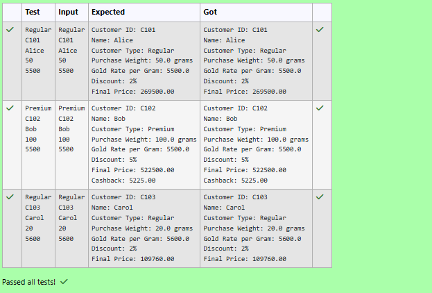

# Ex.No:3(A) INHERITANCE AND AGGREGATION

## QUESTION:
A jewelry store tracks gold rates for different types of customers. The base class is Customer with attributes like customerId, name, and purchaseWeight (in grams). There are two types of customers: RegularCustomer and PremiumCustomer. RegularCustomer gets a fixed discount of 2% on the gold rate per gram. PremiumCustomer gets a 5% discount plus a special cashback. The base gold rate per gram is input at runtime. For each customer, calculate the final price they pay:

```
finalPrice = purchaseWeight * (goldRatePerGram - discount)
```

For PremiumCustomer, additionally show cashback amount (which is 1% of the final price).

## AIM:
To implement inheritance and method overriding for calculating the final gold purchase price of Regular and Premium customers, and to display cashback for Premium customers.

## ALGORITHM :
1.	Start the program.
2.	Import the necessary package 'java.util'
3.	Define a base class Customer.
4. Declare attributes customerId, name, customerType, purchaseWeight, and goldRatePerGram.
5. Create a constructor to initialize all customer details.
6. Define a method getDiscountRate() that returns 0 in the base class.
7. Define a method calculateFinalPrice() to calculate the final price after applying the discount.
8. Define a method cashbackFunc() in the base class.
9. Define a method display() to show customer details, discount, and final price.
10. Create a subclass RegularCustomer that extends Customer.
11. Override getDiscountRate() to return 2%.
12. Create a subclass PremiumCustomer that extends Customer.
13. Override getDiscountRate() to return 5%.
14. Override cashbackFunc() to calculate and display cashback as 1% of the final price.
15. In the main() method, create a Scanner object.
16. Read customer type, customer ID, name, purchase weight, and gold rate per gram.
17. Check the customer type.
18. If the customer type is Regular, create a RegularCustomer object.
19. Otherwise, create a PremiumCustomer object.
20. Display the customer details and final price.
21. If the customer is Premium, calculate and display the cashback amount.
22. Close the Scanner object.
23. End


## PROGRAM:
 ```
/*
Program to implement a Inheritance and Aggregation using Java
Developed by: Vishwaraj G
RegisterNumber: 212223220125
*/
```

## SOURCE CODE:
```java
import java.util.Scanner;
import java.text.DecimalFormat;

class Customer {
    String customerId, name, customerType;
    double purchaseWeight, goldRatePerGram;

    Customer(String customerId, String name, String customerType, double purchaseWeight, double goldRatePerGram) {
        this.customerId = customerId;
        this.name = name;
        this.customerType = customerType;
        this.purchaseWeight = purchaseWeight;
        this.goldRatePerGram = goldRatePerGram;
    }

    double getDiscountRate() {
        return 0;
    }

    double calculateFinalPrice() {
        double discountAmount = goldRatePerGram * getDiscountRate() / 100;
        double effectiveRate = goldRatePerGram - discountAmount;
        return purchaseWeight * effectiveRate;
    }
    
    void cashbackFunc(){
        
    }

    void display() {
        DecimalFormat df = new DecimalFormat("0.00");
        System.out.println("Customer ID: " + customerId);
        System.out.println("Name: " + name);
        System.out.println("Customer Type: "+customerType);
        System.out.println("Purchase Weight: " + purchaseWeight + " grams");
        System.out.println("Gold Rate per Gram: " + goldRatePerGram);
        System.out.printf("Discount: %.0f%%\n", getDiscountRate());
        System.out.println("Final Price: " + df.format(calculateFinalPrice()));
     
    }
}
class RegularCustomer extends Customer{
    public RegularCustomer(String id,String name,String customerType,double weight,double gpg){
        super(id,name,customerType,weight,gpg);
    }
    
    @Override
    double getDiscountRate(){
        return 2;
    }
}
class PremiumCustomer extends Customer{
    public PremiumCustomer(String id,String name,String customerType,double weight,double gpg){
        super(id,name,customerType,weight,gpg);
    }
    
    @Override
    double getDiscountRate(){
        return 5;
    }
    
    @Override
    void cashbackFunc(){
        double fp = calculateFinalPrice();
        double cashback = fp*1/100;
        System.out.printf("Cashback: %.2f",cashback);
    }
}
public class Main{
    public static void main(String[] args){
        String type,id,name;
        double weight,gpg;
        Scanner sc = new Scanner(System.in);
        type = sc.next();
        id = sc.next();
        name = sc.next();
        weight = sc.nextDouble();
        gpg = sc.nextDouble();
        Customer customer;
        if(type.equals("Regular")){
            customer = new RegularCustomer(id,name,type,weight,gpg);
            customer.display();
        } else {
            customer = new PremiumCustomer(id,name,type,weight,gpg);
            customer.display();
            customer.cashbackFunc();
        }
        sc.close();
    }
}
```
## OUTPUT:



## RESULT:
Thus, the program to calculate the final gold purchase price for Regular and Premium customers using inheritance and method overriding was implemented and executed successfully. Cashback was also calculated and displayed for Premium customers.