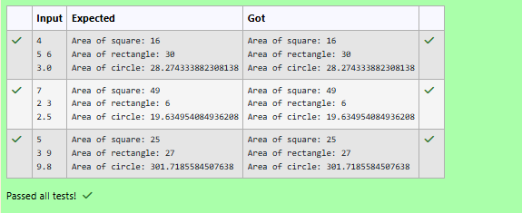

# Ex.No:3(b) POLYMORPHISM

## QUESTION:
Write a Java program that calculates the area of different shapes using method overloading. Create a class AreaCalculator with:

- area(int side) for square

- area(int length, int breadth) for rectangle

- area(double radius) for circle

## AIM:
To calculate the area of a square, rectangle, and circle using method overloading.

## ALGORITHM :
1.	Start the program.
2.	Import the necessary package 'java.util'
3.	Define a class AreaCalculator.
4. Create an overloaded method area(int side) to calculate the area of a square.
5. Create an overloaded method area(int length, int breadth) to calculate the area of a rectangle.
6. Create an overloaded method area(double radius) to calculate the area of a circle.
7. Define the main() method.
8. Create a Scanner object to read input from the user.
9. Create an object of the AreaCalculator class.
10. Read the side of the square.
11. Call area(int side) and display the area of the square.
12. Read the length and breadth of the rectangle.
13. Call area(int length, int breadth) and display the area of the rectangle.
14. Read the radius of the circle.
15. Call area(double radius) and display the area of the circle.
16. Terminate the program.
17. End


## PROGRAM:
 ```
/*
Program to implement a Polymorphism using Java
Developed by: Vishwaraj G
RegisterNumber: 212223220125
*/
```

## SOURCE CODE:
```java
import java.util.Scanner;
class AreaCalculator{
    public int area(int side){
        return side*side;
    }
    public int area(int length,int breadth){
        return length*breadth;
    }
    public double area(double radius){
        return Math.PI*radius*radius;
    }
}
public class Main{
    public static void main(String[] args){
        Scanner sc = new Scanner(System.in);
        AreaCalculator ac = new AreaCalculator();
        int side = sc.nextInt();
        System.out.println("Area of square: "+ac.area(side));
        int length = sc.nextInt();
        int breadth = sc.nextInt();
        System.out.println("Area of rectangle: "+ac.area(length,breadth));
        double radius = sc.nextDouble();
        System.out.println("Area of circle: "+ac.area(radius));
    }
}
```

## OUTPUT:



## RESULT:
Thus, the program to calculate the area of a square, rectangle, and circle using method overloading was implemented and executed successfully.