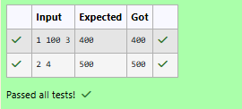

# Ex.No:3(C) ABSTRACTION

## QUESTION:
Create abstract class GameScore with method finalScore().
Subclasses:

- ArcadeGame: score = baseScore + (level × 100)

- PuzzleGame: score = (attempts ≤ 3) ? 1000 - (attempts × 100) : 500

## AIM:
To create an abstract class GameScore and calculate the final score for Arcade and Puzzle games using abstraction.

## ALGORITHM :
1.	Start the program.
2.	Import the necessary package 'java.util'
3.	Define an abstract class GameScore.
3. Declare an abstract method finalScore().
3. Create a subclass ArcadeGame that extends GameScore.
3. Declare variables baseScore and level.
3. Create a constructor to initialize baseScore and level.
3. Override the finalScore() method to calculate the score as baseScore + (level × 100).
3. Create a subclass PuzzleGame that extends GameScore.
3. Declare a variable attempts.
3. Create a constructor to initialize attempts.
3. Override the finalScore() method.
3. If attempts is less than or equal to 3, calculate the score as 1000 − (attempts × 100).
3. Otherwise, assign the score as 500.
3. Define the main() method.
3. Create a Scanner object to read input from the user.
3. Read the game number.
3. If the game number is 1, create an ArcadeGame object and read baseScore and level.
3. Call the finalScore() method and display the result.
3. Otherwise, create a PuzzleGame object and read attempts.
3. Call the finalScore() method and display the result.
3. Terminate the program.
3. End


## PROGRAM:
 ```
/*
Program to implement a Abstraction using Java
Developed by: Vishwaraj G
RegisterNumber: 212223220125
*/
```

## SOURCE CODE:
```java
import java.util.Scanner;
abstract class GameScore{
    abstract int finalScore();
}
class ArcadeGame extends GameScore{
    int baseScore,level;
    public ArcadeGame(int baseScore,int level){
        this.baseScore = baseScore;
        this.level = level;
    }
    public int finalScore(){
        return baseScore + (level * 100);
    }
}
class PuzzleGame extends GameScore{
    int attempts;
    public PuzzleGame(int attempts){
        this.attempts = attempts;
    }
    public int finalScore(){
        return (attempts <= 3) ? 1000 - (attempts * 100) : 500;
    }
}
public class Main{
    public static void main(String[] args){
        int gameNo;
        Scanner sc = new Scanner(System.in);
        gameNo = sc.nextInt();
        if(gameNo == 1){
            ArcadeGame obj = new ArcadeGame(sc.nextInt(),sc.nextInt());
            System.out.println(obj.finalScore());
        } else{
            PuzzleGame obj = new PuzzleGame(sc.nextInt());
            System.out.println(obj.finalScore());
        }
    }
}
```


## OUTPUT:



## RESULT:
Thus, the program to calculate the final score for Arcade and Puzzle games using an abstract class and method overriding was implemented and executed successfully.