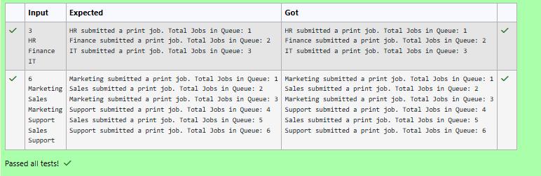

# Ex.No:4(B)  IMPLEMENT SOLID PRINCIPLES IN JAVA PROGRAM 

## QUESTION:
In a large office, multiple departments send print jobs to a shared central printer. To manage load and prevent collision, a Print Spooler Manager handles all job submissions. The IT team insists that there should be only one spooler manager instance in the entire system. Regardless of how many jobs or departments exist, all jobs must pass through this one manager. Your task is to simulate a singleton print job queue. Each print job submitted increases the queue count.

## AIM:
To implement the Singleton design pattern for a Print Spooler Manager and maintain a shared print job queue count.

## ALGORITHM :
1.	Start the program.
2.	Import the necessary package 'java.util'
3.	Define a class PrintSpoolerManager.
4.  Create a private static instance of the class.
4.  Declare a private static variable totalQueue and initialize it to 0.
4.  Define a public static method getInstance().
4.  Return the single instance of PrintSpoolerManager.
4.  Define a method submitJob(String department).
4.  Increment the value of totalQueue.
4.  Return the updated queue count.
4.  Define the main() method.
4.  Create a Scanner object to read input from the user.
4.  Read the number of print jobs.
4.  Repeat the following steps for each job:
    - Read the department name.
    - Obtain the singleton instance using getInstance().
    - Submit the print job using submitJob().
    - Display the department name and the total number of jobs in the queue.
4.  Terminate the program.
4.  End


## PROGRAM:
 ```
/*
Program to implement a SOLID Principles in Java Program
Developed by: Vishwaraj G
RegisterNumber: 212223220125
*/
```

## SOURCE CODE:
```java
import java.util.*;

class PrintSpoolerManager {
    
    private static PrintSpoolerManager instance = new PrintSpoolerManager();
    private static int totalQueue = 0;
    public static PrintSpoolerManager getInstance() {
        //Type your code
        return instance;
    }

    public int submitJob(String department) {
      //Type your code
      return ++totalQueue;
    }
}

public class prog {
    public static void main(String[] args) {
        Scanner sc = new Scanner(System.in);
        int n = sc.nextInt();
        sc.nextLine();

        for (int i = 0; i < n; i++) {
            String dept = sc.nextLine();
            PrintSpoolerManager spooler = PrintSpoolerManager.getInstance();
            int total = spooler.submitJob(dept);
            System.out.println(dept + " submitted a print job. Total Jobs in Queue: " + total);
        }
    }
}
```


## OUTPUT:



## RESULT:
Thus, the program to implement a Singleton Print Spooler Manager and maintain a shared print job queue count was implemented and executed successfully. It was observed that all print jobs were handled through a single manager instance and the queue count increased with each submission.