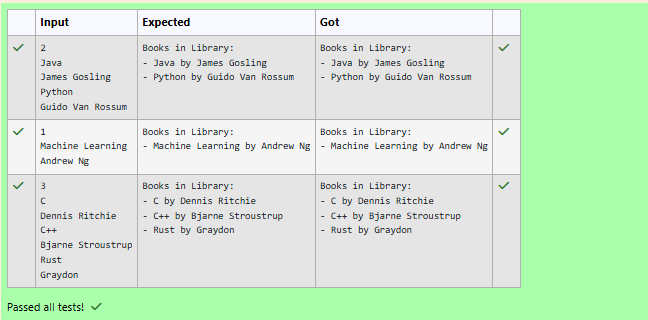

# Ex.No:4(C)  COMPOSITION IN JAVA

## QUESTION:
Implement a system where a Library contains multiple Book objects. Each Book is created inside the Library. Books can't exist independently (Composition).

## AIM:


## ALGORITHM :
1.	Start the program.
2.	Import the necessary package 'java.util'
3.	Define a class Book.
4. Declare private variables title and author.
4. Create a constructor to initialize the book title and author.
4. Define a method getDetails() to return the book details.
4. Define a class Library.
4. Declare an ArrayList to store Book objects.
4. Define a method addBook(String title, String author).
4. Create a new Book object inside the Library class.
4. Add the created Book object to the list.
4. Define a method showBooks().
4. Display the heading "Books in Library:".
4. Traverse the list of books.
4. Display the details of each book.
4. Define the main() method.
4. Create a Scanner object to read input from the user.
4. Create a Library object.
4. Read the number of books.
4. Repeat the following steps for each book:
    - Read the title.
    - Read the author.
    - Add the book to the library using addBook().
4. Invoke showBooks() to display all books in the library.
4. Close the Scanner object.
4. End


## PROGRAM:
 ```
/*
Program to implement a Composition Concepts in Java
Developed by: Vishwaraj G
RegisterNumber: 212223220125
*/
```

## SOURCE CODE:
```java
import java.util.*;

public class CompositionExample {
    public static void main(String[] args) {
        Scanner sc = new Scanner(System.in);
        Library library = new Library();

        int n = sc.nextInt();
        sc.nextLine();

        for (int i = 0; i < n; i++) {
            String title = sc.nextLine();
            String author = sc.nextLine();
            library.addBook(title, author);
        }

        library.showBooks();
        sc.close();
    }
}

class Book {
    private String title;
    private String author;

    public Book(String title, String author) {
        this.title = title;
        this.author = author;
    }

    public String getDetails() {
        return title + " by " + author;
    }
}

class Library {
    private ArrayList<Book> bookList = new ArrayList<>();
    public void addBook(String title, String author) {
        Book bookObj = new Book(title,author);
        bookList.add(bookObj);
    }

    public void showBooks() {
        System.out.println("Books in Library:");
        for(Book bookObjs : bookList){
            System.out.println("- "+bookObjs.getDetails());
        }
    }
}
```


## OUTPUT:



## RESULT:
Thus, the program to demonstrate composition by creating and managing Book objects within a Library class was implemented and executed successfully. It was observed that the Book objects were created and maintained as part of the Library, illustrating composition.