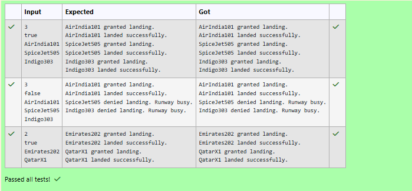

# Ex.No:4(E) DESIGN PATTERN  ---- BEHAVIOUR PATTERN

## QUESTION:
Build a simple Air Traffic Control System where multiple Airplane objects request landing through a central mediator.

## AIM:
To implement an Air Traffic Control System using the Mediator Design Pattern to manage airplane landing requests.

## ALGORITHM :
1.	Start the program.
2.	Import the necessary package 'java.util'
3.	Define the AirTrafficControl class with a runway status variable.
4. Define the Airplane class with airplane name and mediator reference.
4. Create a method in AirTrafficControl to process landing requests.
4. Grant landing if the runway is free; otherwise deny the request.
4. Create a method to release the runway after landing.
4. Read the number of airplanes and runway release option.
4. Create an AirTrafficControl object and airplane objects.
4. Allow each airplane to request landing through the mediator.
4. Release the runway after landing if required.
4. Display the landing status of each airplane.
4. End


## PROGRAM:
 ```
/*
Program to implement a Behaviour Pattern using Java
Developed by: Vishwaraj G
RegisterNumber: 212223220125
*/
```

## SOURCE CODE:
```java
import java.util.*;

class AirTrafficControl {

    private boolean runwayFree;

    public AirTrafficControl(boolean runwayFree) {
        this.runwayFree = runwayFree;
    }

    public void requestLanding(Airplane airplane) {

        if (runwayFree) {

            System.out.println(airplane.getName() + " granted landing.");
            System.out.println(airplane.getName() + " landed successfully.");

        } else {

            System.out.println(airplane.getName() + " denied landing. Runway busy.");
        }

        runwayFree = false;
    }

    public void releaseRunway() {
        runwayFree = true;
    }
}

class Airplane {

    private String name;
    private AirTrafficControl atc;

    public Airplane(String name, AirTrafficControl atc) {
        this.name = name;
        this.atc = atc;
    }

    public String getName() {
        return name;
    }

    public void requestLanding() {
        atc.requestLanding(this);
    }
}

public class AirTrafficSystem {

    public static void main(String[] args) {

        Scanner sc = new Scanner(System.in);

        int n = sc.nextInt();

        boolean releaseAfterLanding = sc.nextBoolean();
        sc.nextLine();

        // Runway initially free
        AirTrafficControl atc = new AirTrafficControl(true);

        List<Airplane> airplanes = new ArrayList<>();

        for (int i = 0; i < n; i++) {

            String name = sc.nextLine();

            airplanes.add(new Airplane(name, atc));
        }

        for (Airplane airplane : airplanes) {

            airplane.requestLanding();

            if (releaseAfterLanding) {
                atc.releaseRunway();
            }
        }

        sc.close();
    }
}
```


## OUTPUT:



## RESULT:
Thus, the program to implement an Air Traffic Control System using the Mediator Design Pattern was implemented and executed successfully. It was observed that all landing requests were coordinated through a central mediator, ensuring controlled access to the runway.