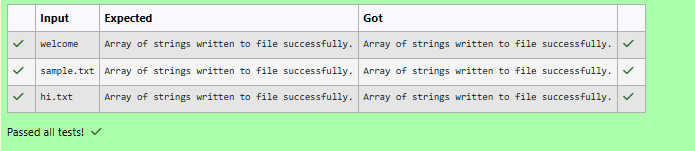

# Ex.No:5(A) INPUTSTREAMREADER 

## QUESTION:
Write a program to write an array of strings into a file using PrintWriter.

## AIM:
To write a string into a file using file output operations in Java.

## ALGORITHM :
1.	Start the program.
2.	Import the necessary package 'java.util'
3.	Create a Scanner object to read input.
4. Read a string from the user.
4. Create a file output stream for the file output.txt.
4. Traverse each character of the string.
4. Write each character into the file.
4. Display a success message.
4. Close the file output stream.
4. Terminate the program.
4. End


## PROGRAM:
 ```
/*
Program to implement a InputStreamReader using Java
Developed by: Vishwaraj G
RegisterNumber: 212223220125
*/
```

## SOURCE CODE:
```java
import java.io.*;
import java.util.Scanner;
public class Main{
    public static void main(String[] args) throws IOException{
        Scanner sc = new Scanner(System.in);
        String str = sc.next();
        FileOutputStream out = new FileOutputStream("output.txt");
        for(int i=0;i<str.length();i++){
            out.write(str.charAt(i));
        }
        System.out.println("Array of strings written to file successfully.");
        out.close();
    }
}
```


## OUTPUT:



## RESULT:
Thus, the program to write a string into a file and store it in output.txt was implemented and executed successfully.