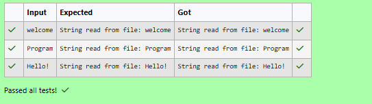

# Ex.No:5(B) SERIALIZATION AND DESERIALIZATION 

## QUESTION:
Write a program to demonstrate reading UTF strings using DataInputStream.

## AIM:
To demonstrate reading a UTF string from a file using DataInputStream.

## ALGORITHM :
1.	Start the program.
2.	Import the necessary package 'java.util'
3.	Create a Scanner object to read input.
4. Read a string from the user.
4. Create a DataOutputStream and write the string to a file using writeUTF().
4. Close the output stream.
4. Create a DataInputStream to read from the same file.
4. Read the UTF string using readUTF().
4. Display the string read from the file.
4. Close the input stream.
4. End


## PROGRAM:
 ```
/*
Program to implement a Serialization and Deserialization using Java
Developed by: Vishwaraj G
RegisterNumber: 212223220125
*/
```

## SOURCE CODE:
```java
import java.io.*;
import java.util.Scanner;

public class DataInputStreamUTFExample {
    public static void main(String[] args) {
        String fileName = "utfdata.dat";
       Scanner sc = new Scanner(System.in);
        try {
            String str = sc.nextLine();
            DataOutputStream dos =
                    new DataOutputStream(
                            new FileOutputStream(fileName));
            dos.writeUTF(str);
            dos.close();
            DataInputStream dis =
                    new DataInputStream(
                            new FileInputStream(fileName));
            String result = dis.readUTF();
            System.out.println("String read from file: " + result);
            dis.close();
        } catch (IOException e) {
            System.out.println(e.getMessage());
        }
        sc.close();
       
    }
}
```


## OUTPUT:



## RESULT:
Thus, the program to write and read a UTF string using DataOutputStream and DataInputStream was implemented and executed successfully.