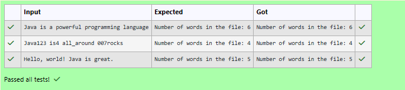

# Ex.No:5(C)  FILE HANDLING USING JAVA
## QUESTION:
Write a program to count the number of words in a file.

## AIM:
To count the number of words present in a file.

## ALGORITHM :
1.	Start the program.
2.	Import the necessary package 'java.util'
3.	Create a file named file.txt.
4. Read a line of text from the user.
4. Write the text into the file.
4. Close the file writer.
4. Open the file for reading.
4. Read each word from the file one by one.
4. Increment the word count for each word read.
4. Display the total number of words in the file.
4. Handle any input/output exceptions.
4. End


## PROGRAM:
 ```
/*
Program to implement a File Handling using Java
Developed by: Vishwaraj G
RegisterNumber: 212223220125
*/
```

## SOURCE CODE:
```java
import java.util.Scanner;
import java.io.*;
public class Main{
    public static void main(String[] args){
        try{
            File file = new File("file.txt");
            file.createNewFile();
            FileWriter fw = new FileWriter(file);
            Scanner sc = new Scanner(System.in);
            fw.write(sc.nextLine());
            fw.close();
            Scanner reader = new Scanner(file);
            int count = 0;
            while(reader.hasNext()){
                reader.next();
                count+=1;
            }
            System.out.println("Number of words in the file: "+count);
        } catch(IOException e3){
            System.out.println(e3.getMessage());
        }
    }
}
```


## OUTPUT:



## RESULT:
Thus, the program to count the number of words present in a file was implemented and executed successfully.