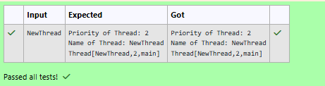

# Ex.No:5(D) THREAD PRIORITY

## QUESTION:
Write a java program for set the priority and name of the current thread.

## AIM:
To set and display the priority and name of a thread in Java.

## ALGORITHM :
1.	Start the program.
2.	Import the necessary package 'java.util'
3.	Define a class that implements the Runnable interface.
4. Declare variables to store thread priority, thread name, and function name.
4. Create a constructor to initialize these variables.
4. Override the run() method to display the thread details.
4. Read the thread name from the user.
4. Create an object of the Runnable class.
4. Create a thread object using the Runnable object.
4. Set the priority of the thread using setPriority().
4. Start the thread using start() and display its details.
4. End


## PROGRAM:
 ```
/*
Program to implement a Thread Priority Concept using Java
Developed by: Vishwaraj G
RegisterNumber: 212223220125
*/
```

## SOURCE CODE:
```java
import java.util.Scanner;
class Thread1 implements Runnable{
    int priority;
    String threadName;
    String funcName;
    public Thread1(int priority,String threadName,String funcName){
        this.priority = priority;
        this.threadName = threadName;
        this.funcName = funcName;
    }
    public void run(){
        System.out.println("Priority of Thread: "+priority);
        System.out.println("Name of Thread: "+threadName);
        System.out.println("Thread["+threadName+","+priority+","+funcName+"]");
    }
}
public class Main{
    public static void main(String[] args){
        Scanner sc = new Scanner(System.in);
        String threadName = sc.nextLine();
        Thread1 t1 = new Thread1(2,threadName,"main");
        Thread thread = new Thread(t1);
        thread.setPriority(2);
        thread.start();
    }
}
```


## OUTPUT:



## RESULT:
Thus, the program to set and display the priority and name of a thread was implemented and executed successfully.