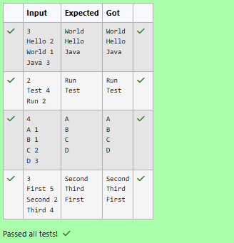

# Ex.No:5(E) MULTITHREADING -SYNCHRONIZATION

## QUESTION:
Use ScheduledExecutorService to delay execution of tasks and print their message.

## AIM:
To delay the execution of tasks and print messages using ScheduledExecutorService.

## ALGORITHM :
1.	Start the program.
2.	Import the necessary package 'java.util'
3.	Create a Scanner object to read input.
4.  Read the number of tasks.
4.  Create a ScheduledExecutorService object.
4.  Read the message and delay time for each task.
4.  Schedule each task using the schedule() method with the specified delay.
4.  Print the message when the task executes.
4.  Shut down the executor service after scheduling all tasks.
4.  Wait for all scheduled tasks to complete.
4.  End


## PROGRAM:
 ```
/*
Program to implement a Synchronization concept using Java
Developed by: Vishwaraj G
RegisterNumber: 212223220125
*/
```

## SOURCE CODE:
```java
import java.util.*;
import java.util.concurrent.*;
public class Main {
    public static void main(String[] args) throws Exception {
        Scanner sc = new Scanner(System.in);
        int n = sc.nextInt();
        sc.nextLine();
        ScheduledExecutorService ses = Executors.newSingleThreadScheduledExecutor();
        for(int i = 0; i < n; i++) {
            String message = sc.next();
            int delay = sc.nextInt();
            ses.schedule(() -> {
                System.out.println(message);
            }, delay, TimeUnit.SECONDS);
        }
        ses.shutdown();
        ses.awaitTermination(10, TimeUnit.SECONDS);
        sc.close();
    }
}
```


## OUTPUT:



## RESULT:
Thus, the program to delay task execution and print messages using ScheduledExecutorService was implemented and executed successfully.